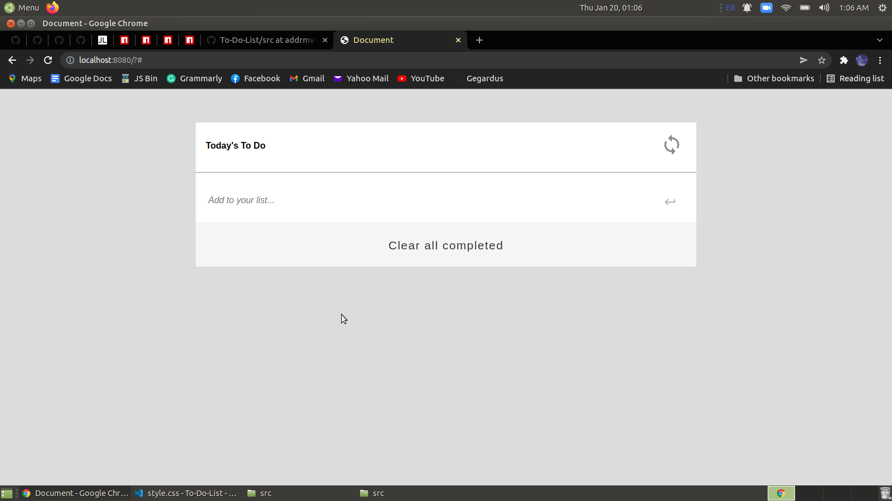
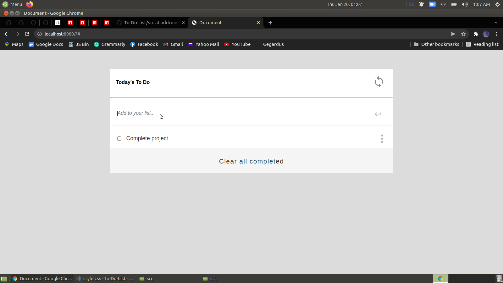
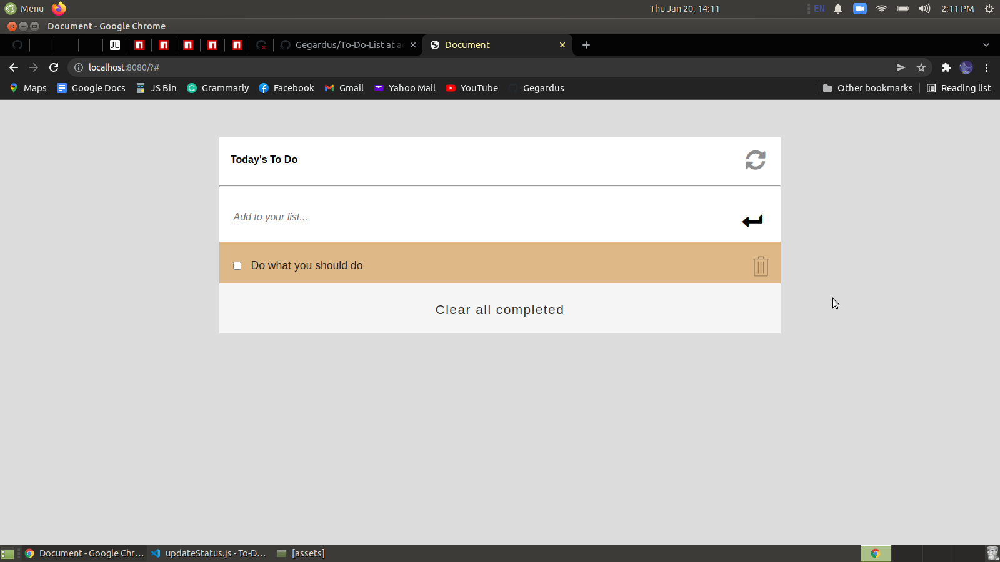

# Title

To Do list: add & remove

> This is a simple HTML list of To Do tasks.

## Built With

- HTML
- CSS
- JavaScript

## Getting Started

To get a local copy up and running follow these simple example steps:

## Live Demo

[Live Demo Link](https://aeon9300.github.io/To-Do-List/)

## Getting Started

* Install Node.js ^12.13

https://github.com/aeon9300/To-Do-List.git

* Install packages
    npm install
    
* To run application using webpack-dev-server
    npm start

## Author

👤 **Adebisi Ayodele Samuel**

- GitHub: [@githubhandle](https://github.com/aeon9300)
- Twitter: [@twitterhandle](https://twitter.com/aeon9300)
- LinkedIn: [LinkedIn](https://www.linkedin.com/in/samuel-adebisi-4a589362/)

## Author

Adebisi Ayodele Samuel

- GitHub: (https://github.com/aeon9300)

## 🤝 Contributing

Contributions, issues, and feature requests are welcome!

Feel free to check the [issues page](../../issues/).

## Show your support

Give a ⭐️ if you like this project!

## 📝 License

This project is [MIT](./MIT.md) licensed.
=======