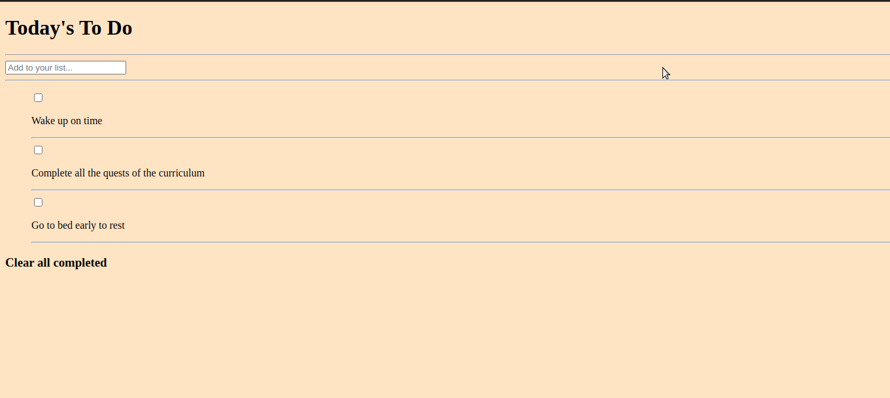

# Project Name

To Do list: list structure

> This is a simple HTML list of To Do tasks.

## Built With

- HTML
- CSS
- JavaScript

## Live Demo

[Live Demo Link](#)

## Getting Started

https://github.com/aeon9300/To-Do-List.git

## Author

👤 **Adebisi Ayodele Samuel**

- GitHub: [@githubhandle](https://github.com/aeon9300)
- Twitter: [@twitterhandle](https://twitter.com/aeon9300)
- LinkedIn: [LinkedIn](https://www.linkedin.com/in/samuel-adebisi-4a589362/)

## Author

Adebisi Ayodele Samuel

- GitHub: (https://github.com/aeon9300)

## 🤝 Contributing

Contributions, issues, and feature requests are welcome!

Feel free to check the [issues page](../../issues/).

## Show your support

Give a ⭐️ if you like this project!

## 📝 License

This project is [MIT](./MIT.md) licensed.
=======